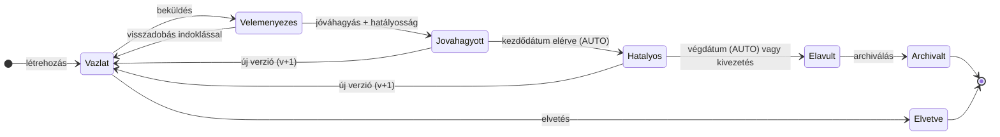

# Állapotgép, szerepkörök és ütemező

Az elem-**verziók** életciklusát egy állapotgép vezérli. A státusz a verzión tárolt mező, a léptetést felhasználói művelet (szerepkörhöz kötve) vagy az ütemező (dátum alapján) végzi. Ez a rendszer egyik legkritikusabb logikája — **a `packages/shared`-ben él, tiszta függvényként, és a backend kényszeríti ki.**

> A **Véleményezés** és a **Jóváhagyott** állapot belső folyamatát (szálazott megjegyzések, négy-szem-elv, döntés + indoklás, a jóváhagyás bővíthetősége) külön dokumentum részletezi: `docs/velemenyezes-jovahagyas.md`.

## Állapotok

| Státusz | Jelentés | Szerkeszthető? |
|---|---|---|
| **Vázlat** | munkapéldány | igen |
| **Véleményezés** | beküldve, jóváhagyásra vár | nem (zárolt) |
| **Jóváhagyott** | elfogadva, hatályba lépésre vár | nem |
| **Hatályos** | érvényben, kezdet–vég intervallummal | nem |
| **Elavult** | hatályát vesztette | nem |
| **Archivált** | végállapot (lezárt) | nem |
| **Elvetve** | végállapot (törlés helyett, auditnyommal) | nem |

## Átmenetek

| Honnan | Hova | Kiváltó | Szerepkör / mód |
|---|---|---|---|
| – | Vázlat | létrehozás | Szerző |
| Vázlat | Véleményezés | beküldés | Szerző |
| Vázlat | Elvetve | elvetés (veszélyes) | Szerző |
| Véleményezés | Vázlat | visszadobás (indoklással, veszélyes) | Jóváhagyó |
| Véleményezés | Jóváhagyott | jóváhagyás + hatályosság megadása | Jóváhagyó |
| Jóváhagyott | Hatályos | **kezdődátum elérve** | **AUTO** (ütemező, `ki=RENDSZER`) |
| Jóváhagyott | Vázlat | új verzió nyitása (v+1) | Szerző |
| Hatályos | Vázlat | új verzió nyitása (v+1) | Szerző |
| Hatályos | Elavult | **végdátum elérve** vagy kivezetés | **AUTO** / Admin (kivezetés, veszélyes) |
| Elavult | Archivált | archiválás | Admin |
| Archivált | – | végállapot | – |
| Elvetve | – | végállapot | – |

> Ennek a táblának a konkrét TypeScript-vázlata (`ATMENETEK` + segédfüggvények + az ütemező döntési logikája): `docs/domain-mag-vazlat.md`.

A diagram szövegesen (Mermaid `stateDiagram-v2`), ha vizualizálni kell:

## Műveletmenü státuszonként

A felület a verzió aktuális státusza és a felhasználó szerepköre alapján rakja össze a léptető gombokat (a prototípus `lephetMenu()` logikája szerint):

- **Vázlat** → „Beküldés véleményezésre” (Szerző) · „Elvetés” (Szerző, veszélyes)
- **Véleményezés** → „Jóváhagyás…” (Jóváhagyó) · „Visszadobás…” (Jóváhagyó, veszélyes)
- **Jóváhagyott / Hatályos** (ha nincs még újabb aktív verzió) → „Új verzió nyitása (v+1)” (Szerző)
- **Hatályos** → „Kivezetés…” (Admin, veszélyes)
- **Elavult** → „Archiválás” (Admin)

A „veszélyes” műveletek megerősítő párbeszédet kapnak. A jóváhagyás és a kivezetés dátumbekérő dialógust nyit (hatálykezdet / hatályvég).

## Ütemező (Ütemező)

Háttérfolyamat, amely **dátum alapján** lépteti az automata átmeneteket. A prototípusban gombbal és szimulált dátummal (`simDatum()`) futtatható; **éles rendszerben ütemezett job** (pl. napi `node-cron`), valós `now()`-val. A futás legyen **idempotens** és minden átmenetet naplózzon `ki=RENDSZER`-rel.

Logika (a prototípus `utemezoFut()`-ja alapján):

1. **Jóváhagyott → Hatályos**, ha `hatalyKezdet <= ma`. Ilyenkor a korábbi Hatályos verzió is lép: `hatalyVeg = az új verzió kezdete`, és Elavultba kerül (napló: „leváltotta: v{n}”).
2. **Hatályos → Elavult**, ha `hatalyVeg < ma`.

## Tervezési indoklás (a kollégának is ez a megokolás)

1. **Jóváhagyott vagy Hatályos verzió tartalma nem szerkeszthető** — módosítás kizárólag új verzióval. Ez garantálja, hogy amire valaha hivatkoztak, az változatlanul visszakereshető.
2. **A hatályosság a verzión tárolt kezdet–vég dátumpár**; a végdátum üresen hagyható („visszavonásig”). Az állapot **tárolt és ütemezővel léptetett**, nem futásidőben számított — így auditálható és értesítés köthető hozzá.
3. **Új verzió hatályba lépésekor a régi végdátuma automatikusan az új kezdete** — nincs „lyuk” vagy átfedés a hatályosságban.
4. **Törlés helyett Elvetve állapot** — az auditnyom állami környezetben kötelező.
5. **A „Felfüggesztett” állapot tudatosan kimaradt**, később bővíthető.

## Szerepkörök

| Szerepkör | Jogok |
|---|---|
| **Olvasó** | megtekintés (kartoték, gráf, riportok) |
| **Szerző** | elem és vázlat létrehozása/szerkesztése, beküldés, elvetés, új verzió nyitása |
| **Jóváhagyó** | jóváhagyás, visszadobás |
| **Admin** | kivezetés, archiválás, szolgáltatás/alkalmazás CRUD, jogosultságkezelés |
| **RENDSZER** | automata átmenetek (ütemező) — nem valódi felhasználó |

A szerepkör **alkalmazásra szabott**: egy felhasználónak alkalmazásonként lehet szerepe (pl. Kiss Anna Szerző a 3R-en, Varga Dóra a Terminuson). Nagy Péter a FAIR szolgáltatásgazdája → Admin. Modellezés: `(felhasználó × alkalmazás × szerepkör)` hozzárendelés, plusz egy globális Admin lehetőség. A backend minden státuszátmenetnél és minden CRUD-nál ellenőrzi a hatókört.

> A teljes jogosultsági mátrixot (művelet × szerepkör), a hatókör-szabályokat és a négy-szem-elv overlay-t külön dokumentum részletezi: `docs/szerepkorok-jogosultsagok.md`. Az **archiválás** (`Elavult → Archivált`) pontos szabályai a `CLAUDE.md` „Archiválási szabályok” szakaszában vannak.
