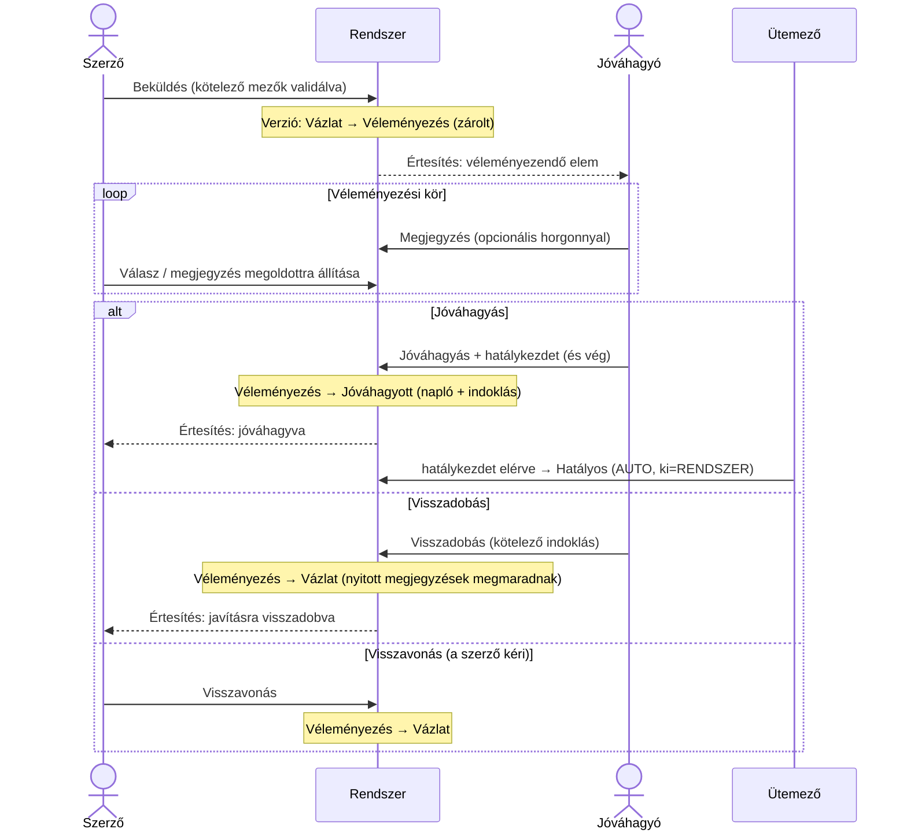

# Véleményezési és jóváhagyási folyamat

Ez a dokumentum részletesen kidolgozza, hogyan jut el egy verzió a Vázlattól a Hatályos állapotig — a **véleményezés** (visszajelzés, megjegyzések) és a **jóváhagyás** (döntés, hatályosság) lépésein át. Az állapotgép kereteit a `docs/allapotgep.md` adja; ez a dokumentum a két érintett állapot (**Véleményezés**, **Jóváhagyott**) belső folyamatát írja le.

## A folyamat egy ábrán

## Szereplők és a négy-szem-elv

- **Szerző** küldi be a verziót, válaszol a megjegyzésekre, és (új verzió nyitásával vagy visszadobás után) javít.
- **Jóváhagyó** véleményez (megjegyzések) és dönt (jóváhagyás vagy visszadobás).
- **Olvasó** a folyamatot és a megjegyzéseket látja, de nem avatkozik be.

**Négy-szem-elv (kötelező):** aki a verziót **létrehozta vagy szerkesztette**, az **nem lehet a jóváhagyója**. A backend ezt kikényszeríti: a jóváhagyás művelet elutasul, ha a döntő felhasználó szerepel a verzió szerzői/szerkesztői között. Állami környezetben ez a feladatkör-szétválasztás (segregation of duties) alapköve.

**Hatókör:** a szerepkör alkalmazásra szabott (lásd `docs/allapotgep.md`). A véleményezésre váró elemet **az adott alkalmazás bármelyik Jóváhagyója elviheti** (pull-modell) — nincs kötelező előzetes kiosztás. (Opcionális bővítés: egy „elvállalom” gomb, amely a döntés idejére az aktuális Jóváhagyóhoz rendeli az elemet, hogy ne dolgozzanak ketten ugyanazon.)

## 1. Beküldés (Szerző)

- **Előfeltétel — kötelező mezők:** a verzió csak akkor küldhető be, ha a kartoték-sablon kötelező mezői ki vannak töltve (cím, leírás, típusfüggő mezők). A validáció a `shared` Zod-sémáiból jön; a sablon betartatása az **eszköz** dolga, nem a fegyelemé (lásd `docs/migracio.md`).
- A beküldéssel a verzió **Vázlat → Véleményezés** állapotba lép, és **zárolódik** (a tartalma nem szerkeszthető).
- A rendszer **értesíti** az alkalmazás Jóváhagyóit (lásd Értesítések).

## 2. Véleményezési kör (megjegyzések)

A munka közbeni visszajelzés csatornája a **beágyazott megjegyzés** (`megjegyzesek[]` a verzióban — lásd `docs/adatmodell.md`). Ez több, mint egy elutasítási indok: iteratív, dokumentált párbeszéd.

- **Ki ír:** a Jóváhagyó ad visszajelzést; a Szerző válaszolhat (a `valaszMjid` szálazza a választ).
- **Horgony (opcionális):** a megjegyzés a leírás egy szakaszára mutathat (`horgony`), így célzott.
- **Állapot:** minden megjegyzés `nyitott` vagy `megoldott`. A Szerző (a javítás után) megoldottra állíthatja; a Jóváhagyó látja, mi maradt nyitva.
- A megjegyzések **megmaradnak** a verzión a döntés után is (audit). Új verzió nyitásakor az új verzió tiszta lappal indul (a megjegyzések a régi verzióhoz tartoznak).

> A megjegyzések önmagukban **nem léptetik** az állapotot — a verzió Véleményezésben marad, amíg a Jóváhagyó nem dönt, vagy a Szerző vissza nem vonja.

## 3. Döntés (Jóváhagyó)

Két kimenet:

### 3/a Jóváhagyás
- A Jóváhagyó megadja a **hatálykezdetet** (kötelező) és opcionálisan a **hatályvéget** (üresen = „visszavonásig”).
- Opcionális **jóváhagyási megjegyzés** (a Státusznaplóba kerül indoklásként).
- A verzió **Véleményezés → Jóváhagyott** állapotba lép; a napló rögzíti (ki, mikor, indoklás).
- Innen az **ütemező** lépteti **Hatályossá**, amikor a hatálykezdet elérkezik (`ki=RENDSZER`); ekkor a korábbi Hatályos verzió Elavultba kerül, és a végdátuma az új kezdetére áll (lásd `docs/allapotgep.md`).

### 3/b Visszadobás
- **Kötelező indoklás.** A verzió **Véleményezés → Vázlat** állapotba kerül (újra szerkeszthető), a napló rögzíti az indoklást.
- A **nyitott megjegyzések megmaradnak**, így a Szerző látja, mit kell javítania.
- Javítás után a Szerző újra beküldheti ugyanazt a verziót.

### 3/c Visszavonás (a Szerző kezdeményezi)
- A Szerző a döntés előtt **visszavonhatja** a beküldést: **Véleményezés → Vázlat**. Tiszta affordancia arra, ha menet közben derül ki, hogy javítani kell — nem kell megvárni a Jóváhagyó elutasítását. (A naplóban a „ki” a Szerző.)

## Jóváhagyás mélysége — javaslat és bővíthetőség

**v1 alapértelmezés: egylépcsős jóváhagyás + négy-szem-elv.** Egy Jóváhagyó döntése elég; a szerző ≠ jóváhagyó szabály kötelező. Ez a legtöbb elemnél arányos és gyors.

**Bővíthetőség séma-átírás nélkül.** A jóváhagyást **jóváhagyási szabályként** (approval policy) modellezzük, amely **alkalmazásonként (vagy típusonként)** megadható, és **kötelező jóváhagyási lépések rendezett listája**. v1-ben ez egyetlen lépés (egy Jóváhagyó). Később bekapcsolható:

- **Kétlépcsős** (pl. technikai → üzleti): két, eltérő szerep/feltétel szerinti lépés, sorrendben. A verzió csak az utolsó lépés után lép Jóváhagyottba.
- **Testületi (kvórum):** több Jóváhagyó, és meghatározott számú „igen” kell.

A lépéseket egy beágyazott `jovahagyasiLepesek[]` napló rögzíti a verzión (ki, mikor, melyik lépés, eredmény). Mivel ez **adatvezérelt szabály**, nem hardkódolt útvonal, a bővítés konfiguráció, nem átírás. (A `shared` állapotgép a „mikor léphet Jóváhagyottba” feltételt a policy alapján értékeli ki.)

> Döntési pont a kollégákkal: van-e olyan elemtípus (pl. `BUS`), ahol indulásból kétlépcsős jóváhagyás kell? Ha igen, az a policy alapértékében állítható be — a modell már most felkészült rá.

## Értesítések

- **Beküldéskor** → az alkalmazás Jóváhagyói értesítést kapnak (van véleményeznivaló).
- **Döntéskor** (jóváhagyás/visszadobás) → a Szerző értesítést kap.
- **Új megjegyzéskor** → a másik fél (Szerző ↔ Jóváhagyó) értesítést kaphat.
- Csatorna: felületi értesítés alapból, opcionálisan e-mail. A részletes kidolgozás a `docs/utiterv.md` Fázis 7-éhez tartozik, de a folyamat szempontjából itt rögzítettük az eseményeket.

## Audit

- Minden állapotátmenet a **Státusznaplóba** kerül (ki, mikor, honnan, hová, indoklás) — lásd `docs/adatmodell.md`.
- A **megjegyzések** és (bekapcsolt többlépcsős jóváhagyásnál) a **jóváhagyási lépések** is a verzión maradnak, így a teljes döntési folyamat visszakövethető.
- A formális döntési indok (visszadobásnál kötelező, jóváhagyásnál opcionális) a naplóban a hivatalos nyom; a megjegyzések a munka közbeni párbeszéd.

## Élhelyzetek

- **Párhuzamos szerkesztés:** a Véleményezésben lévő verzió zárolt; tartalmi változtatáshoz visszadobás vagy visszavonás kell. Ha új, eltérő tartalom kell egy már Hatályos elemhez, az **új verzió** (v+1), ami külön megy végig a folyamaton.
- **Csak egy Jóváhagyó van, és az a szerző:** a négy-szem-elv miatt a jóváhagyás blokkolódik — kell még egy Jóváhagyó az alkalmazáson. Ez **üzemeltetési követelmény**: alkalmazásonként legalább egy, a szerzőtől különböző Jóváhagyó legyen kijelölve.
- **Visszadobott verzió újraküldése:** ugyanaz a verzió megy vissza Véleményezésre (nem keletkezik új verziószám); a korábbi megjegyzések kontextusként ott vannak.
